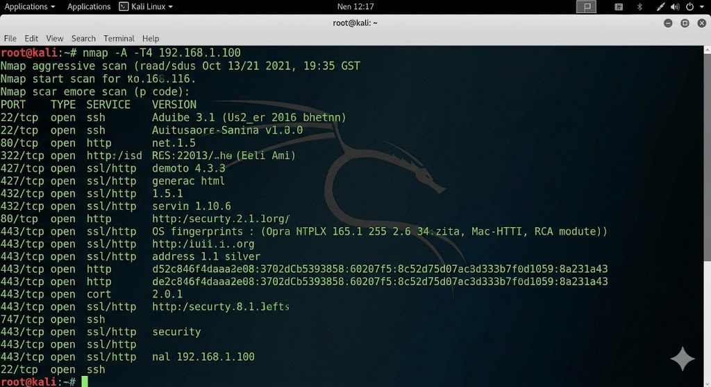
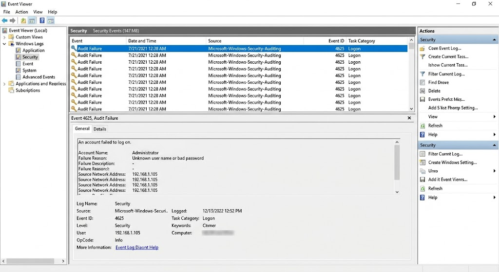
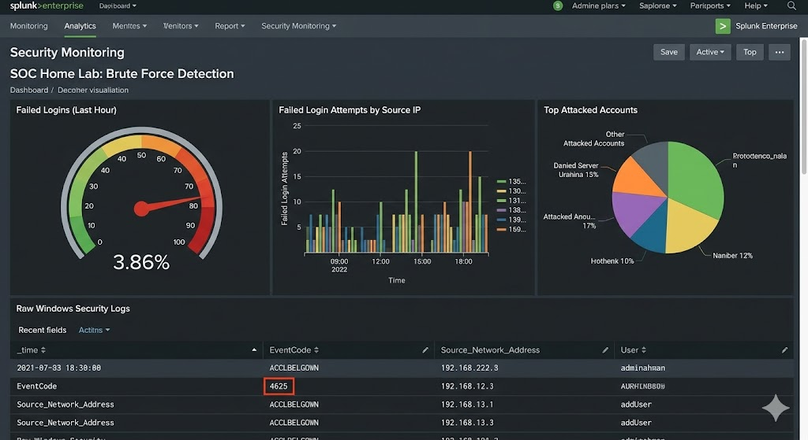
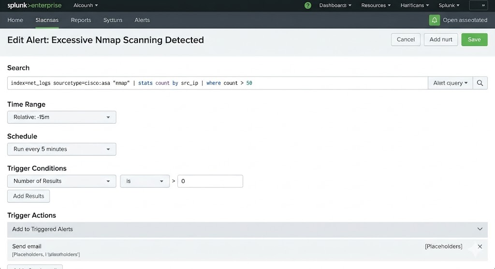
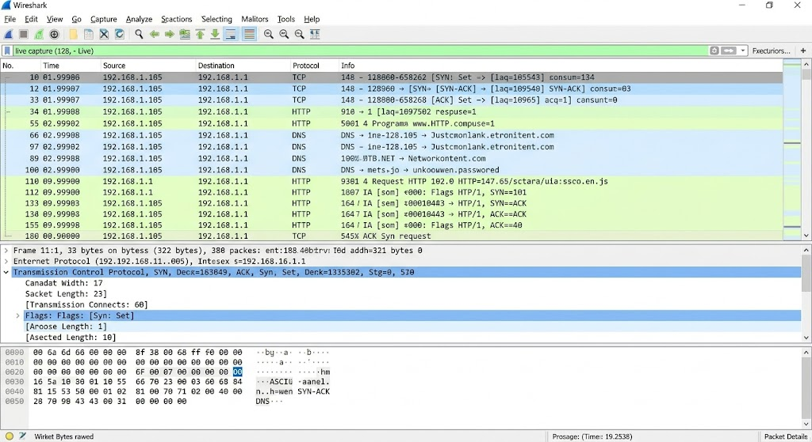

<h1 align="center">SOC Home Lab – Cyber Attack Detection</h1>

A practical <b>Security Operations Center (SOC) Home Lab</b> project demonstrating how cyber attacks can be simulated and investigated using security monitoring tools.

<h2>Project Overview</h2>

This project demonstrates a simulated cyber attack scenario where an attacker machine (<b>Kali Linux</b>) performs reconnaissance and network scanning against a target Windows system.

The activity is then analyzed using:

<ul>
<li>Windows Security Logs</li>
<li>Splunk SIEM Dashboard</li>
<li>Network Packet Analysis using Wireshark</li>
</ul>

The goal of this lab is to understand how <b>Security Operations Center (SOC) analysts detect suspicious activities and investigate potential security incidents.</b>

<h2>Lab Architecture</h2>

<pre>
Kali Linux (Attacker VM)
        |
        |  Network Reconnaissance (Nmap)
        |
Windows Host Machine (Target)
        |
        |  Security Event Logs
        |
Splunk SIEM Monitoring
        |
SOC Investigation
</pre>

<h2>Tools Used</h2>

<table>
<tr>
<th>Tool</th>
<th>Purpose</th>
</tr>

<tr>
<td>Kali Linux</td>
<td>Attacker machine used to perform network reconnaissance</td>
</tr>

<tr>
<td>Nmap</td>
<td>Network scanning and port discovery</td>
</tr>

<tr>
<td>Windows Event Viewer</td>
<td>Monitoring Windows security logs</td>
</tr>

<tr>
<td>Splunk SIEM</td>
<td>Security monitoring and threat detection</td>
</tr>

<tr>
<td>Wireshark</td>
<td>Network traffic packet analysis</td>
</tr>

<tr>
<td>VirtualBox</td>
<td>Virtual lab environment</td>
</tr>

</table>

<h2>Attack Simulation</h2>

The attacker machine performs network reconnaissance using <b>Nmap</b> to identify open ports and services on the target system.

<h3>Command Used</h3>

<pre>
nmap -sS &lt;target-ip&gt;
</pre>

<h3>Aggressive Scan</h3>

<pre>
nmap -A &lt;target-ip&gt;
</pre>

These scans help attackers discover:

<ul>
<li>Open ports</li>
<li>Running services</li>
<li>Operating system information</li>
<li>Network distance</li>
</ul>

<h2>Network Scan Result</h2>

The attacker discovers open ports and services running on the target system.

<b>Key Findings</b>

<ul>
<li>Open TCP ports detected</li>
<li>Service versions identified</li>
<li>Operating system fingerprinting</li>
</ul>

<h2>Windows Security Log Analysis</h2>

Windows records failed authentication attempts in the <b>Security Event Log</b>.

<b>Event ID:</b> 4625

<b>Description:</b> An account failed to log on

SOC analysts monitor this event to detect potential security threats such as:

<ul>
<li>Brute force login attacks</li>
<li>Unauthorized login attempts</li>
<li>Credential abuse</li>
</ul>

<h2>Splunk SIEM Monitoring</h2>

Splunk is used to collect and analyze security logs from the system.

The dashboard visualizes authentication failures and suspicious activity.

SOC analysts use this dashboard to identify attack patterns and monitor system security.

<h2>Splunk Alert Rule</h2>

An alert rule was configured in Splunk to detect excessive Nmap scanning activity.

The alert triggers when multiple scanning attempts are detected from a single source IP address.

<h2>Network Traffic Analysis</h2>

Wireshark was used to capture and analyze network packets generated during the scanning activity.

Packet analysis allows SOC analysts to understand the communication between the attacker and target machine.

<h2>SOC Investigation Workflow</h2>

<ol>

<li><b>Reconnaissance Detection</b> – Identify suspicious network scanning activity</li>

<li><b>Log Analysis</b> – Investigate authentication failures in Windows logs</li>

<li><b>Threat Identification</b> – Determine whether activity is malicious</li>

<li><b>Incident Documentation</b> – Record evidence and findings</li>

</ol>

<h2>Skills Demonstrated</h2>

<ul>

<li>Network reconnaissance analysis</li>
<li>Port scanning investigation</li>
<li>Windows security log analysis</li>
<li>SIEM monitoring using Splunk</li>
<li>Network packet analysis with Wireshark</li>
<li>Cyber attack simulation</li>

</ul>

<h2>Learning Outcomes</h2>

<ul>

<li>Understanding reconnaissance phase of cyber attacks</li>
<li>Investigating authentication failure logs</li>
<li>Monitoring security events using SIEM tools</li>
<li>Analyzing network packets for suspicious activity</li>

</ul>

<h2>Future Improvements</h2>

<ul>

<li>Automated brute force detection rules</li>
<li>Integration with threat intelligence feeds</li>
<li>Real-time SIEM alert notifications</li>
<li>Advanced anomaly detection dashboards</li>

</ul>

<h2>Author</h2>

<b>Geerla Achyutha</b> 
Cybersecurity Enthusiast 
GitHub: https://github.com/Achyuth7891

